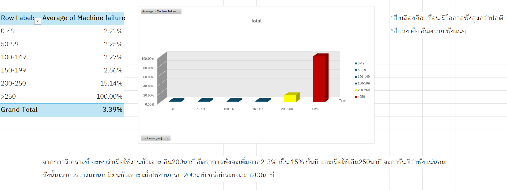
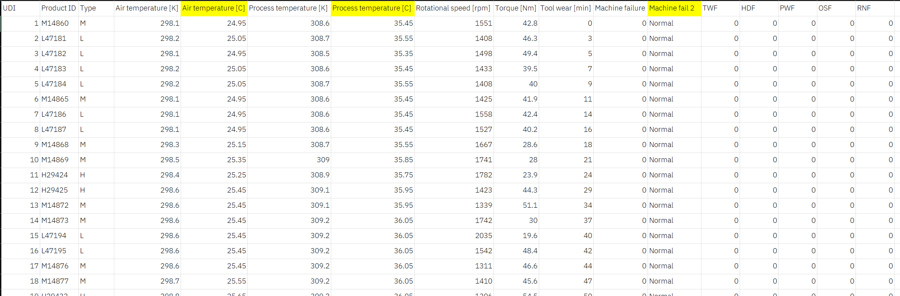

# 🏭 Predictive Maintenance Analysis Project

### 📊 Project Overview
This project focuses on analyzing **Machine Failure Patterns** using the standard AI4I 2020 Predictive Maintenance Dataset. The goal is to identify critical indicators that lead to equipment breakdown and propose a data-driven maintenance strategy.

---

### 🖼️ Dashboard Preview

*(รูป Dashboard แสดงกราฟความสัมพันธ์ระหว่างระยะเวลาการใช้งานหัวเจาะกับอัตราการพัง)*

---

### 💡 Key Findings (Business Insight)
From the analysis of 10,000+ operational records, I discovered:
1.  **Critical Threshold:** Machines with **Tool Wear > 200 minutes** show a failure rate of **15.3%**, compared to only 2% in normal conditions.
2.  **Immediate Action:** Any usage beyond **250 minutes** results in **100% failure probability**.
3.  **Recommendation:** Implement a **Preventive Maintenance Schedule** to replace tools every 200 minutes to reduce unplanned downtime.

---

### 🛠️ Tools & Skills Used
- **Data Source:** [AI4I 2020 Predictive Maintenance Dataset](https://www.kaggle.com/datasets/stephanmatzka/predictive-maintenance-dataset-ai4i-2020?resource=download)
- **Software:** Microsoft Excel (Advanced Pivot Tables, Data Analysis)
- **Techniques:** Data Cleaning, Statistical Analysis, Interactive Dashboard, Slicers.

---

### 📂 How to View
You can download the full Excel file to explore the interactive dashboard here:
[Download Excel File](งานซ้อมในresume1.xlsx)

